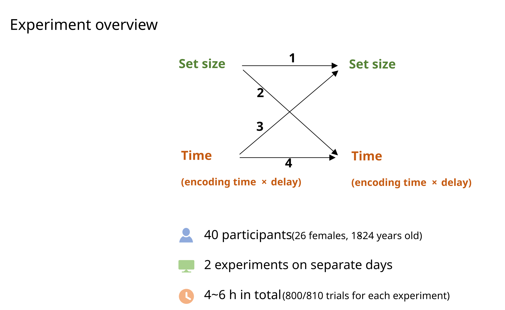
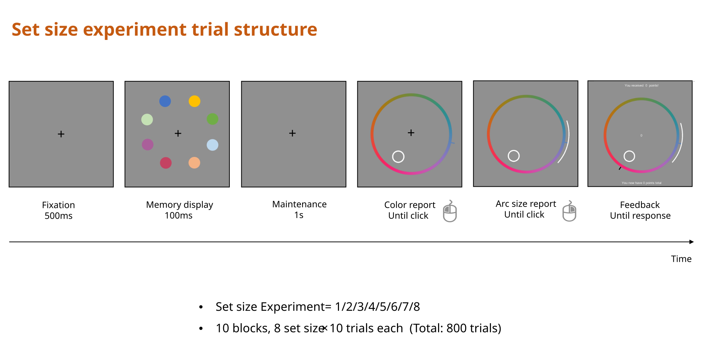
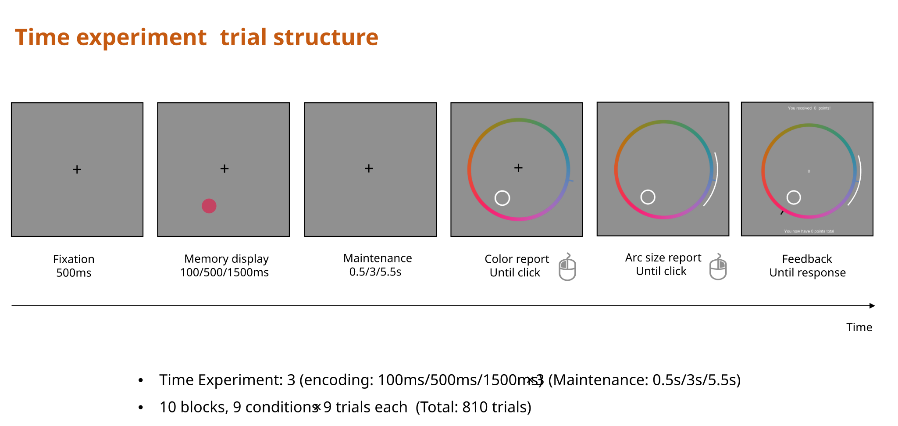

## Overview

This page describes the experimental design of Experiment 1 and provides codebooks for both the raw and preprocessed data files. 

## Experiment 1

### Motivation

In the standard continuous reproduction paradigm, participants study a visual feature (e.g., a color) and later reproduce it on a continuous response scale (e.g., a color wheel). The angular error between the response and the target indexes memory precision — but a single trial's error is just a sample from an underlying distribution, not a direct readout of that trial's memory quality.

To obtain a trial-level uncertainty estimate, participants additionally drew a symmetric **arc** around their point response, indicating the range of values they consider plausible. An incentive-compatible scoring rule ensured that participants were motivated to set this arc thoughtfully.

### Participants

Forty participants (four groups of 10) each completed two experimental sessions. The four groups differed in which experiment they performed in each session: 

1. Set size & Set size
2. Set size & Time
3. Time & Set size
4. Time & Time. 

Thus, some participants performed the same experiment twice, while others performed both experiments (see `experimentorder` and `exp_cond` below). Participants ranged in age from approximately 18–30 years.

{width=80%}

### Stimuli

On each trial, 1–8 colored circles appeared at evenly-spaced positions around a central fixation point. Colors were drawn from a 360° color wheel with a random offset on every trial (recorded in `colorwheel0degree`). Unused item slots were coded as `999` (= `NA`) in the raw data.

### Procedure

Each trial proceeded as follows:

1. **Encoding** — The memory array appeared for a fixed duration (`encodingtime`; 0.1 s, 0.5 s, or 1.5 s depending on condition).
2. **Retention interval** — A blank delay followed (`delay`; 0.5 s, 1.0 s, 3.0 s, or 5.5 s depending on condition).
3. **Point response** — One item was cued (`testposition`). A color wheel appeared and the participant clicked to report the remembered color. The angular position of the response is recorded as `responseangle`.
4. **Arc setting** — The participant adjusted a symmetric arc centered on their point response, indicating the range of colors they believed could contain the target. The half-width of this arc (in degrees) is recorded as `arcsize`.

{width=100%}

{width=100%}

### Scoring

Points on each trial were computed as:

$$
p = (\pi - \alpha) \cdot \mathbf{1}[|y| \le \alpha],
$$

where $y$ is the signed response error (difference between the response and the correct color, in radians) and $\alpha$ is the arc half-width (in radians). If the true color fell within the arc, the participant earned $\pi - \alpha$ points; otherwise they earned 0. This creates an accuracy–confidence tradeoff: wider arcs are more likely to capture the target but yield fewer points.

### Design

The experiment used two within-subject manipulations organized into separate session types:

| Session type   | Manipulation                           | Variable         | Levels                         |
|:---------------|:---------------------------------------|:-----------------|:-------------------------------|
| **Set size**   | Number of items in the memory array    | `setsize`        | 1, 2, 3, 4, 5, 6, 7, 8        |
| **Time**       | Encoding duration × retention interval | `encodingtime`   | 0.1 s, 0.5 s, 1.5 s           |
|                |                                        | `delay`          | 0.5 s, 1.0 s, 3.0 s, 5.5 s   |

In the set-size sessions, each block contained trials with all eight set sizes in random order (set size always 1 item in the time condition sessions). In the time sessions, encoding duration and retention interval were crossed factorially.

## Data Codebook: Raw Data

**File:** `data-raw/exp1_2021_data.csv`
**Rows:** 64,400 | **Participants:** 40

All angular variables (colors, positions, responses) are in **degrees** (0–360 for colors; signed for errors).

### Trial identification

| Variable           | Type | Description                                                                 |
|:-------------------|:-----|:----------------------------------------------------------------------------|
| `subject`          | int  | Participant identifier (numeric)                                            |
| `age`              | int  | Participant age in years                                                    |
| `experimentorder`  | int  | Which session this was for the participant (1 = first visit, 2 = second)    |
| `blocknumber`      | int  | Block number within the session                                             |
| `trialnumber`      | int  | Trial number within the block                                               |

### Stimulus display

| Variable                 | Type | Description                                                                            |
|:-------------------------|:-----|:---------------------------------------------------------------------------------------|
| `setsize`                | int  | Number of items displayed (1–8)                                                        |
| `position1`–`position8`  | int  | Screen position index for each item (1–8); `NA` for unused slots                      |
| `p1color`–`p8color`      | int  | Color of each item in degrees on the color wheel (0–360); `999` = unused slot          |
| `colorwheel0degree`      | chr  | RGB values at the 0° position of the color wheel (random offset each trial)            |
| `colorwheel0degreeR`     | num  | Red channel of the color wheel 0° position                                             |
| `colorwheel0degreeG`     | num  | Green channel of the color wheel 0° position                                           |
| `colorwheel0degreeB`     | num  | Blue channel of the color wheel 0° position                                            |

### Test probe

| Variable             | Type | Description                                                                          |
|:---------------------|:-----|:-------------------------------------------------------------------------------------|
| `testposition`       | int  | Position index of the probed item (1–8)                                              |
| `colorcorrectangle`  | int  | Correct color of the probed item, in degrees on the color wheel                      |
| `position`           | int  | Screen position of the probed item (appears to be `NA` in set-size sessions)         |
| `pcolor`             | int  | Probed item color (alternative coding; `NA` in set-size sessions)                    |

### Response

| Variable           | Type | Description                                                                           |
|:-------------------|:-----|:--------------------------------------------------------------------------------------|
| `responseangle`    | int  | Participant's point response on the color wheel, in degrees                           |
| `anglediff`        | int  | Signed response error: `responseangle − colorcorrectangle` (degrees, −180 to 179)    |
| `arcsize`          | num  | Arc half-width set by the participant (degrees, 0–233.75)                             |
| `points`           | num  | Points earned on this trial (0 if miss; based on degree-scale formula)                |
| `pointstotal`      | num  | Cumulative points earned up to and including this trial                                |
| `rtclick1`         | num  | Response time for the point response click (seconds)                                  |
| `rtclick2`         | num  | Response time for the arc-width adjustment click (seconds)                            |

### Color-space transformations

| Variable               | Type | Description                                                                       |
|:-----------------------|:-----|:----------------------------------------------------------------------------------|
| `RawAnglePosition`     | int  | Raw angular position on the wheel before correction                                |
| `CorrectedWheelAngle`  | int  | Wheel angle corrected for the random offset                                        |
| `anglediff_c`          | num  | Corrected response error (degrees)                                                 |
| `presentedColor`       | int  | Target color expressed in the canonical (unrotated) color space (degrees)          |
| `responseColor`        | int  | Response color expressed in the canonical (unrotated) color space (degrees)        |

### Experimental conditions

| Variable           | Type | Description                                                                           |
|:-------------------|:-----|:--------------------------------------------------------------------------------------|
| `encodingtime`     | num  | Duration of the memory display (seconds): 0.1, 0.5, or 1.5                           |
| `delay`            | num  | Retention interval (seconds): 0.5, 1.0, 3.0, or 5.5                                  |
| `exp_type`         | chr  | Session type on the current visit: `"SetS"` (set-size) or `"Time"` (time)            |
| `part1_type`       | chr  | Session type during first visit: `"SetS"` or `"Time"`                                 |
| `part2_type`       | chr  | Session type during second visit: `"SetS"` or `"Time"`                                |
| `exp_cond`         | chr  | Combined session-order label: `"SetS_SetS"`, `"SetS_Time"`, `"Time_SetS"`, `"Time_Time"` |

## Data Codebook: Preprocessed Data

**File:** `output/exp1_data.csv`
**Rows:** 64,365 (35 trials with `arcsize > 180°` removed) | **Participants:** 40

Preprocessing is performed by `preprocess_exp1_data()` in [R/data-functions.R](../R/data-functions.R). The following transformations are applied:

1. **`999` → `NA`**: Sentinel values in unused item slots are replaced with `NA`.
2. **Degree-to-radian conversion**: All angular color and response variables (columns matching `p[1-8]color`, `*[Aa]ngle*`, and `*Color`) are converted from degrees to radians via `bmm::deg2rad()` and wrapped to $[-\pi, \pi]$ via `bmm::wrap()`.
3. **Arc filtering**: Trials where `arcsize > 180°` are removed (these represent arcs covering more than the full semicircle).
4. **Column renaming**:
   - `anglediff` → `resperr` (response error, now in radians)
   - `arcsize` → `arc` (arc width, converted to the **full arc** in radians: `arc = deg2rad(arcsize × 2)`; i.e., this is the full arc, not the half-width)

### Key differences from raw data

| Variable   | Raw data                        | Preprocessed data                                |
|:-----------|:--------------------------------|:-------------------------------------------------|
| `resperr`  | `anglediff`: degrees, −180–179  | Radians, wrapped to $[-\pi, \pi]$               |
| `arc`      | `arcsize`: half-width, degrees  | Full arc width in radians ($[0, 2\pi]$)          |
| Colors     | Degrees (0–360)                 | Radians, wrapped to $[-\pi, \pi]$               |
| Filtering  | All 64,400 trials               | 64,365 trials (35 extreme-arc trials removed)    |

All other columns retain their original names and semantics, with the same radian conversion applied to angular variables.

## Full technical details

### Participants

Forty students (26 female) from Sun Yat-sen University aged between 18 and 24 years (M=20) were recruited to participate in this study. They all had a normal or corrected-to-normal vision. The participants received 30 CNY per hour after completing the experiment. Participants gave written informed consent before their participation. The experimental protocol was approved by the institutional review board at the Department of Psychology, Sun Yat-sen University.
There are two experiments, the Set size experiment, and the Time experiment. On two separate days (1-22 days between experiments, M=4), participants were randomly assigned to perform one of the two experiments. That is, there were four groups regarding different combinations of these two experiments. Each participant completed two Set size experiments / Set size then Time experiments / Time then Set size experiments / two Time experiments. 

### Stimuli and apparatus

The program of each experiment was prepared under MATLAB 2019a with PsychToolbox extensions and implemented on a Windows 10 (64-bit) desktop computer with a 27-inch LCD (60Hz of refresh rate) and a standard QWERTY keyboard in a dark laboratory room with acoustic shielding. The monitor was placed 57 cm away from the participant. Participants were shown colored dots (1.26° radius) of eccentricity 5.3° on a gray background (20 cd/m2), which occurred at one of the eight potential locations selected from an octagon. The color wheel was 1° thick and was centered on the monitor with a radius of 8°. It consisted of 360 equidistant colors from the CIE L*a*b space (centered at L = 54, a = 18, and b = 8; radius of 59). The sample colors were randomly selected with a minimum difference of 15 degrees from the color wheel. All colors had equal luminance (roughly 20 cd/m2).

### Procedure

#### Set size experiment

A trial began with a 500-ms fixation (Figure 1). In the memory display, there were 1~8 colored dots. After a 1000-ms blank screen, participants reported the color of the item probed by a white circle on a color wheel, by clicking the left mouse button. A bar of the clicked color (length = 1°, thickness = 0.5°) would occur on the clicked location. Then they reported the uncertainty of their memory by adjusting the arc width centered on their first click (arc thickness = 0.5°, radius = 9°). If the true color was within their reported arc, participants got points inversely related to the arc size (points = 180 – arc width, where arc width is the size in degrees of one-half the symmetric arc). If the arc did not include the presented color, they got 0 points to discourage giving very small intervals. The total points and the points of the current trial would be presented on the screen until they pressed the space key. There was a 1000-ms interval between trials.

There was a 1-min break every 80 trials. There were 10 practice trials and 800 trials (10 blocks) in the formal experiment with 100 trials for each set size condition. Within each block, there was roughly an equal number of trials for each set size, and that the order of set sizes was randomized.

#### Time experiment

A trial began with a 500-ms fixation (Figure 2). In the memory display, there was always one colored dot, randomly occurring on one of the eight fixed locations. The colored dot was presented for 100ms/ 500ms/ 1500ms. Then there was a blank screen for 0.5s/ 3s/ 5.5s. Participants then reported the color of the item probed by a white circle on a color wheel, by clicking the left mouse button. Then they reported the uncertainty of their memory by adjusting the arc width centered on their first click. The points would be calculated and presented in the same way with Set size experiment. There was a 1000-ms interval between trials.
There was a 1-min break every 81 trials. There were 10 practice trials and 810 trials (10 blocks) in the formal experiment with 100 trials for each time condition (9 conditions, encoding time:100ms/ 500ms/ 1500ms, delay duration: 0.5s/ 3s/ 5.5s). Within each block, there was roughly an equal number of trials for each condition, and that the order of conditions was randomized.
 

